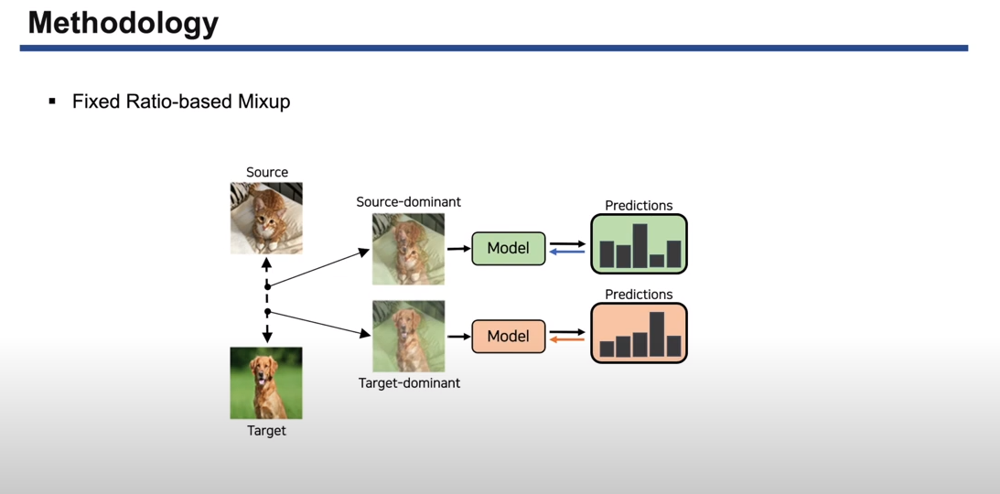

<div align="center">

## FixBi: Bridging Domain Spaces for Unsupervised Domain Adaptation
  
[](https://paperswithcode.com/sota/domain-adaptation-on-office-31?p=fixbi-bridging-domain-spaces-for-unsupervised)
  [](https://paperswithcode.com/sota/domain-adaptation-on-office-home?p=fixbi-bridging-domain-spaces-for-unsupervised)
  [](https://paperswithcode.com/paper/fixbi-bridging-domain-spaces-for-unsupervised)

[](https://arxiv.org/abs/2011.09230)
[](https://openaccess.thecvf.com/content/CVPR2021/html/Na_FixBi_Bridging_Domain_Spaces_for_Unsupervised_Domain_Adaptation_CVPR_2021_paper.html)

</div>

> **FixBi: Bridging Domain Spaces for Unsupervised Domain Adaptation**<br>
> [Jaemin Na](https://github.com/NaJaeMin92), Heechul Jung, Hyung Jin Chang, Wonjun Hwang<br>
> In CVPR 2021.<br>

<!-- [YouTube](https://www.youtube.com/watch?v=c55rRO-Aqac&ab_channel=JaeminNa)<br> -->
> **Abstract:** *Unsupervised domain adaptation (UDA) methods for learning domain invariant representations have achieved remarkable progress. However, most of the studies were based on direct adaptation from the source domain to the target domain and have suffered from large domain discrepancies. In this paper, we propose a UDA method that effectively handles such large domain discrepancies. We introduce a fixed ratio-based mixup to augment multiple intermediate domains between the source and target domain. From the augmented-domains, we train the source-dominant model and the target-dominant model that have complementary characteristics. Using our confidence-based learning methodologies, e.g., bidirectional matching with high-confidence predictions and self-penalization using low-confidence predictions, the models can learn from each other or from its own results. Through our proposed methods, the models gradually transfer domain knowledge from the source to the target domain. Extensive experiments demonstrate the superiority of our proposed method on three public benchmarks: Office-31, Office-Home, and VisDA-2017.*

## Table of Contents
  - [Introduction](#Introduction)
  - [Requirements](#Requirements) 
  - [Getting Started](#getting-started)
  - [Citation](#Citation)

## Introduction

> **Video:** Click the figure to watch the explanation video.

[](https://www.youtube.com/watch?v=c55rRO-Aqac&ab_channel=JaeminNa) 

## Requirements
- Linux
- Python >= 3.7
- PyTorch == 1.7.1 
- CUDA (must be a version supported by the pytorch version)

## Getting Started

#### Training process.
Below we provide an example for training a FixBi on Office-31.
```bash
python main.py \
-gpu 0,1
-source amazon \
-target dslr \
-db_path $DATASET_PATH \
-baseline_path $BASELINE_PATH \
-save_path $SAVE_PATH
```
- `$DATA` denotes the location where datasets are installed.
- `$BASELINE_PATH` requires the path where pretrained models (DANN, MSTN, etc.) are stored.
- For DANN, the following code may be used: [pytorch-DANN](https://github.com/NaJaeMin92/pytorch_DANN)

## Citation
If you use this code in your research, please cite:
```bibtex
@InProceedings{na2021fixbi,
  title     = {FixBi: Bridging Domain Spaces for Unsupervised Domain Adaptation},
  author    = {Jaemin Na and Heechul Jung and Hyung Jin Chang and Wonjun Hwang},
  booktitle = {Proceedings of the IEEE/CVF Conference on Computer Vision and Pattern Recognition (CVPR)},
  year      = {2021}
}
```
